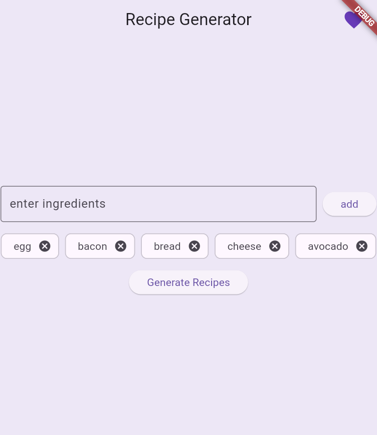
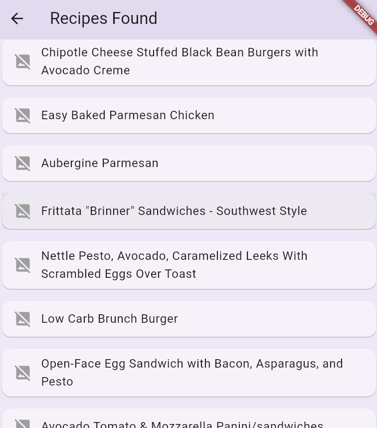
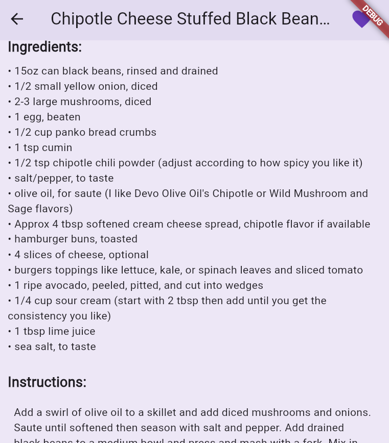
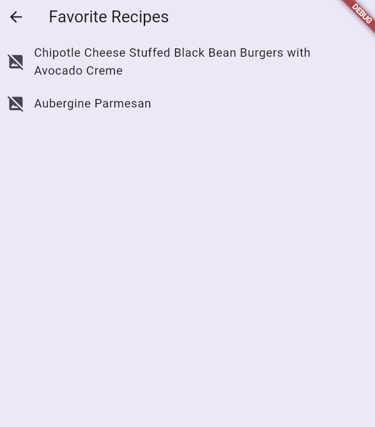

# Recipe-Generator

A personal mobile app that helps you cook smarter, save money, and reduce food waste.  
Simply input the ingredients you have at home, and the app will generate delicious recipes for you!

Built using Flutter and the Spoonacular API.

## Features

- Ingredient Input: Add ingredients manually via a simple input field.
- Smart Recipe Suggestions: Uses the Spoonacular API to generate recipes based on your ingredients.
- Favorites: Save your favorite recipes with a heart icon and view them later.
- Recipe Details: See full instructions and ingredients, rendered with HTML support.
- Local Persistence: Favorites are stored using `SharedPreferences` so they stay saved across app launches.
- Clean UI: Light purple aesthetic with user-friendly design.

## Technologies

- Frontend: Flutter (Dart)
- State Management: Provider
- Backend API: [Spoonacular Food API](https://spoonacular.com/food-api)
- Local Storage: Shared Preferences

## How to Run
1. Clone the Repository
2. Fetch dependencies: flutter pub get
3. Run the app

## Screenshots

### Main Screen to Search Ingredients

### Recipes Screen

### Recipe Deatils Screen

### Favorite Recipes Screen

